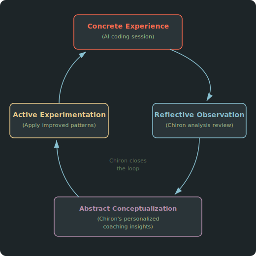
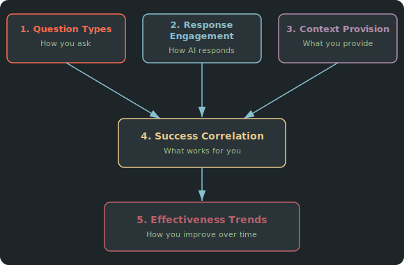
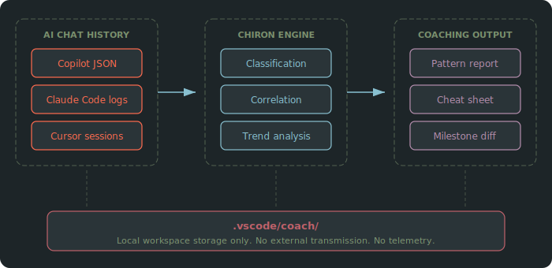
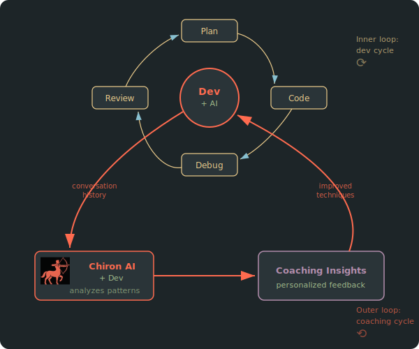

<!-- markdownlint-disable MD033 MD041 -->
<div align="center">


<picture>
  <source media="(prefers-color-scheme: dark)" srcset="assets/datastone_logo.png">
  <source media="(prefers-color-scheme: light)" srcset="assets/datastone_logo.png">
  
</picture>
</p>

# The Chiron Coaching Methodology

[](LICENSE)

</div>
<!-- markdownlint-enable MD033 MD041 -->

## A Data-Driven Approach to AI Collaboration Coaching for Software Developers

<!-- markdownlint-disable-next-line MD036 -->
*Version 1.0 | dataStone Inc. | 2026*

## Executive Summary

Most organizations investing in AI coding assistants cannot measure whether their developers are using them effectively. Industry studies show mixed results: the 2024 Uplevel study found Copilot users produced 41% more bugs with no measurable improvement in throughput. The problem is not the tools. It is how developers interact with them.

The Chiron Coaching Methodology addresses this gap by analyzing a developer's actual AI conversation history to produce personalized, evidence-based coaching. Rather than prescribing generic prompting advice, Chiron discovers what already works for each individual and builds on it.

The approach is grounded in established learning science: Kolb's experiential learning cycle, Argyris's double-loop learning, and Ericsson's deliberate practice framework. It applies these principles to a new domain where no structured improvement methodology previously existed.

Key results from initial research: trimming an overly verbose AI instruction file by 67% increased conversation depth by 500% and technical engagement by 90%. These findings were invisible without data. They are the kind of insight Chiron surfaces for every developer who uses it.

Chiron operates as a VS Code extension that analyzes conversations with GitHub Copilot, Claude Code, and other assistants. All data stays local. There is no telemetry. Coaching data belongs to the developer, not to their employer or a vendor.

For enterprise teams, the value proposition is straightforward: measurable improvement in AI tool effectiveness without surveillance, ranking, or individual performance reporting.

---

## Table of Contents

1. [Why "Chiron"](#why-chiron)
2. [The Problem](#the-problem)
3. [Theoretical Foundations](#theoretical-foundations)
4. [Why Self-Analysis Works](#why-self-analysis-works)
5. [The Five Dimensions](#the-five-dimensions)
6. [How It Works](#how-it-works)
7. [Progressive Confidence](#progressive-confidence)
8. [Evidence-Grounded Coaching](#evidence-grounded-coaching)
9. [Domain Awareness](#domain-awareness)
10. [Privacy Model](#privacy-model)
11. [Principles](#principles)
12. [References](#references)

---

## Why "Chiron"

In Greek mythology, Chiron (pronounced *Kai-ron*) was a centaur (a mythological creature half horse, half man) and the most renowned teacher of the ancient world. Unlike other centaurs, who were wild and violent, Chiron was wise, skilled in medicine and the arts, and devoted to mentoring. He trained some of the greatest figures in Greek myth: Achilles, Asclepius (the founder of medicine), Jason, and others.

What made Chiron distinctive was not that he fought battles for his students. He taught them to fight their own. His method was personal. He observed each student's nature and shaped his teaching to it. Asclepius learned healing. Achilles learned combat. The instruction fit the individual.

The name reflects the methodology. Chiron does not prescribe universal best practices. It observes your actual patterns, identifies what works for you, and coaches you to do more of it. It is a mentor that teaches through evidence drawn from your own experience.

---

## The Problem

Developers using AI coding assistants get better at it over time, but the improvement is accidental. You discover through trial and error that providing constraints gets better answers, or that a particular way of describing a bug leads to faster fixes. But these discoveries are implicit. You cannot articulate what changed, you cannot measure it, and you cannot accelerate it.

Generic advice does not help. "Be specific" and "provide context" are true but useless in the same way "eat healthy" is useless dietary advice. What developers need is a mirror: a concrete picture of their actual collaboration patterns, grounded in their own conversations, showing what works and what does not.

This gap has real organizational consequences. Enterprise teams invest significantly in AI coding tools. CFOs ask for ROI data. Engineering leaders cannot provide it because no one measures the variable that matters most: how effectively developers collaborate with these tools.

The industry measures the wrong things. Lines of code, pull request velocity, and DORA metrics capture team throughput but miss the interaction layer entirely. A developer who writes excellent prompts and a developer who fights the AI for twenty minutes to get a working function both show up the same in these dashboards.

Chiron addresses the interaction layer directly. It reads your AI conversation history, classifies every exchange, and coaches you based on evidence from your own work.

---

## Theoretical Foundations

The Chiron Coaching Methodology did not emerge from theory first. It emerged from analyzing real data and then recognizing that the patterns it surfaced align with decades of research in learning science. The theoretical grounding validates and extends the approach and explains why it works.

### Kolb's Experiential Learning Cycle

David Kolb's experiential learning model (1984) describes learning as a four-stage cycle: concrete experience, reflective observation, abstract conceptualization, and active experimentation.

<!-- Mermaid diagram of Kolb's cycle like svg below
```mermaid
graph TD
    CE["Concrete Experience<br/>(AI coding session)"] --&gt; RO["Reflective Observation<br/>(Chiron analysis review)"]
    RO --&gt; AC["Abstract Conceptualization<br/>(Personalized coaching insights)"]
    AC --&gt; AE["Active Experimentation<br/>(Apply improved patterns)"]
    AE --&gt; CE
```
-->
<!-- markdownlint-disable MD033 MD041 -->
<div align="center">



</div>
<!-- markdownlint-enable MD033 MD041 -->

Most developers complete only the first stage. They have the experience (the AI session) but skip reflection entirely. The session ends, the code ships, and whatever worked or failed remains unexamined. Chiron closes the loop by providing structured reflection (stage 2), translating patterns into actionable insights (stage 3), and enabling deliberate practice of improved techniques (stage 4).

### Argyris's Double-Loop Learning

Chris Argyris distinguished between single-loop and double-loop learning. Single-loop learning adjusts actions within existing assumptions: "That prompt didn't work, I'll try a different one." Double-loop learning questions the assumptions themselves: "Why am I always writing implementation prompts when exploratory prompts produce better results in my domain?"

<!-- Mermaid diagram of single-loop vs double-loop learning like svg below
```mermaid
graph LR
    subgraph Single-Loop
        A1[Action] --&gt O1[Outcome] --&gt A1
    end
    subgraph Double-Loop
        AS[Assumptions] --&gt A2[Action] --&gt O2[Outcome] --&gt AS
    end
```
-->
<!-- markdownlint-disable MD033 MD041 -->
<div align="center">


</div>
<!-- markdownlint-enable MD033 MD041 -->

Generic prompting advice operates at the single-loop level. It tells you to adjust your prompts. Chiron operates at the double-loop level. It surfaces the underlying patterns in how you interact with AI and asks whether those patterns serve your goals. When a developer discovers that 80% of their questions are implementation-focused while their most effective sessions used exploratory framing, that is a double-loop insight. It changes not just what they type but how they think about AI collaboration.

### Ericsson's Deliberate Practice

Anders Ericsson's research on expert performance (1993) identified the conditions that distinguish practice from deliberate practice: clear goals, immediate feedback, focus on weaknesses, and sustained effort at the edge of current ability.

AI collaboration lacks all four conditions by default. There are no clear goals for "good prompting." Feedback is delayed and ambiguous (did the session go well because of my prompt or despite it?). Weaknesses are invisible. And there is no structured way to practice.

Chiron provides each condition. Effectiveness metrics define goals. Evidence-grounded coaching provides feedback tied to specific interactions. Pattern analysis highlights weaknesses. Milestone comparisons track deliberate improvement over time.

### Why Theory Matters Here

These frameworks are not decorative. They explain a specific phenomenon: why reading a list of "10 tips for better AI prompting" does not change behavior, while reviewing your own conversation data does.

Tips fail because they skip the experiential foundation (Kolb), operate at the wrong loop (Argyris), and lack the feedback conditions for skill development (Ericsson). Chiron succeeds where tips fail because it addresses all three gaps simultaneously, using the developer's own data as the foundation.

---

## Why Self-Analysis Works

The conversations you have already had with AI coding assistants contain all the information needed to improve your collaboration. Every turn is a data point. Every session that resolved quickly tells you something about what you did right. Every session that required five rounds of clarification tells you something about what you could do differently.

This is more powerful than prescriptive advice for three reasons.

**Relevance.** Your patterns are specific to your domain, your experience level, and your working style. A PostgreSQL systems programmer asking about planner internals has different effective patterns than a React developer building components. Chiron detects your workspace domain and tailors its analysis accordingly.

**Credibility.** When a recommendation includes a snippet from your own conversation showing a pattern that worked, it carries more weight than an abstract tip. You can see it, recognize it, and verify it against your own experience.

**Measurability.** Because the analysis is quantitative (effectiveness percentages, pattern frequencies, trend lines over time) you can track whether you are actually improving. Milestone comparisons let you measure before and after a deliberate change.

---

## The Five Dimensions

Chiron analyzes conversations across five dimensions. Each captures a different aspect of the human-AI collaboration dynamic.

<!-- Mermaid diagram of the five dimensions like svg below
```mermaid
graph TD
    QT["1. Question Types<br/>(How you ask)"] --&gt SC["4. Success Correlation<br/>(What works)"]
    RE["2. Response Engagement<br/>(How AI responds)"] --&gt SC
    CP["3. Context Provision<br/>(What you provide)"] --&gt SC
    SC --&gt ET["5. Effectiveness Trends<br/>(How you improve)"]
```
-->

<!-- markdownlint-disable MD033 MD041 -->
<div align="center">



</div>
<!-- markdownlint-enable MD033 MD041 -->

### 1. Question Types

How you formulate questions affects what kind of answer you get. Chiron classifies your questions into categories (exploratory, clarifying, implementation-focused, debugging, and others) and measures which types are most effective for you in your domain.

The insight is not that one type is universally better. It is that most developers over-index on one type (typically implementation questions like "write me a function that...") and under-use others (like exploratory questions that help frame a problem before solving it). Seeing the distribution, backed by effectiveness data, makes the imbalance visible.

### 2. Response Engagement

This dimension looks at the other side: how the AI responds to you. Responses are classified by engagement type: analytical (deep reasoning), proposing (suggesting approaches), clarifying (asking for more info), confirming (agreeing with your approach), and self-correcting (revising a previous answer).

Certain question patterns from you reliably trigger certain response types from the AI. If your goal is analytical depth and you are consistently getting generic acknowledged responses, the engagement data shows you where the disconnect is.

### 3. Context Provision

The single most impactful factor in AI collaboration effectiveness is context quality. Chiron measures how much context you provide (technical constraints, error messages, environment details, expected behavior) and correlates it with outcomes.

This dimension produces the most actionable coaching. The contrast between a vague question that required three follow-ups and a constrained question that got an immediate answer is concrete and immediately applicable.

### 4. Success Correlation

Which of your interaction patterns actually achieve your goals? Chiron tracks outcome signals across sessions (immediate resolution, iterative refinement needed, abandoned threads) and correlates them with the patterns from the other dimensions.

This is where the analysis moves from descriptive ("here is what you do") to prescriptive ("here is what works"). A pattern that appears frequently but has low effectiveness is a coaching opportunity. A pattern that is rare but highly effective is something to do more of.

### 5. Effectiveness Trends

Patterns evolve. The question types that dominated your early sessions may differ from your current ones. Chiron tracks how your patterns change over time and whether the changes correlate with improved outcomes.

This dimension enables milestone analysis: compare your patterns before and after a specific event (a project change, a deliberate effort to improve, adopting a new tool) and measure the impact.

---

## How It Works

Chiron operates as a VS Code extension that registers as `@coach` in the Copilot chat panel. The architecture is minimal by design, with the methodology stored in editable markdown files rather than hardcoded logic.

<!-- Mermaid diagram of the architecture like svg below
```mermaid
graph LR
    subgraph Input
        A["Copilot JSON"]
        B["Claude Code"]
        C["Cursor logs"]
    end
    subgraph Engine["Chiron Engine"]
        D["Classification"]
        E["Correlation"]
        F["Trend analysis"]
    end
    subgraph Output["Coaching Output"]
        G["Pattern report"]
        H["Cheat sheet"]
        I["Milestone diff"]
    end
    Input --&gt Engine --&gt Output
    all --&gt S[".vscode/coach/ local storage"]
```
-->

<!-- markdownlint-disable MD033 MD041 -->
<div align="center">



</div>
<!-- markdownlint-enable MD033 MD041 -->

The workflow has three phases.

**Extract.** Chiron reads conversation history from your AI tool's local storage. For GitHub Copilot, this is the `chatSessions/` directory in VS Code's workspace storage. For Claude Code, it reads session logs from `~/.claude/`. The extraction is read-only. Chiron never modifies your conversation files.

**Analyze.** Each conversation turn is classified across the five dimensions. The classification uses an LLM call (routed through the same AI backend you already use) with a compressed domain-aware prompt. Pattern correlations are computed across sessions. Milestone comparisons use git history to identify before/after boundaries.

**Coach.** Results are presented as structured coaching artifacts: a pattern summary, a personalized cheat sheet of your effective techniques, and (when enough data exists) trend analysis showing improvement over time. All artifacts are stored in `.vscode/coach/` and can be reviewed, edited, or deleted at any time.

### The Meta-Recursive Loop

There is an additional layer that makes the system self-improving. Chiron's coaching recommendations are themselves interactions with an AI. The quality of its analysis prompts affects the quality of its coaching output. Over time, the methodology files that drive classification can be refined based on what produces useful insights.

<!-- Mermaid diagram of the meta-recursive loop like svg below
```mermaid
graph TD
    A["Developer improves prompting"] --&gt B["Better AI outputs"]
    B --&gt C["Coaching sees what worked"]
    C --&gt D["Better recommendations"]
    D --&gt A
```
-->

<!-- markdownlint-disable MD033 MD041 -->
<div align="center">



</div>
<!-- markdownlint-enable MD033 MD041 -->

This is not autonomous AI self-improvement. The developer remains in the loop at every stage, deciding which recommendations to adopt and whether the coaching is useful. But it creates a compounding effect: small improvements in collaboration skill lead to better AI outputs, which produce richer data for the next coaching cycle.

---

## Progressive Confidence

Analysis quality depends on data volume. Chiron handles this through progressive confidence: insights are available from the first session, but they are marked with confidence indicators that reflect how much data backs them.

| Data Volume | Confidence Level | What Chiron Provides |
| ------------- | ----------------- | ------------------- |
| 1-2 sessions | Preliminary | Initial pattern identification, basic question type distribution |
| 3-5 sessions | Emerging | Cross-session trends, early effectiveness correlations |
| 6-10 sessions | Moderate | Statistically meaningful patterns, reliable coaching recommendations |
| 10+ sessions | High | Trend analysis, milestone comparisons, validated improvement tracking |

This design avoids the cold-start problem (requiring N sessions before providing any value) while being transparent about the reliability of early insights. The analysis tells you where it is on this spectrum and what additional data would strengthen its confidence.

---

## Evidence-Grounded Coaching

Coaching recommendations in Chiron are always accompanied by evidence from your own conversations. This is a deliberate design choice, grounded in Kolb's principle that learning starts with concrete experience.

When the analysis identifies a strength, it shows you a real snippet where that pattern worked:

```text
Strong Context Provision (85% effective)

What Worked:
  Example from Jan 15:
  You: "Help me optimize this database query.
  Currently taking 2s on 10K rows. PostgreSQL
  14, need to keep under 500ms."

  -> Immediate resolution
  -> AI acknowledged approach
```

When it identifies an opportunity, it shows a concrete contrast:

```text
Opportunity: Add Technical Constraints

Less Effective:
"How do I cache API responses?"

More Effective:
"How do I cache API responses? Redis preferred,
TTL 5 min, need to handle cache misses gracefully."
```

When it tracks improvement, it shows the evolution:

```text
Pattern Evolution: Context Provision

Before (Dec):
"Fix this bug" -> Required 3 follow-ups

After (Jan):
"This validation fails for emails with + signs.
Regex pattern in user.ts line 45." -> Immediate fix
```

Snippets are truncated to approximately 300 characters, capped at 3 per session, and stored locally in the workspace. They preserve enough context to be useful without retaining entire conversations.

---

## Domain Awareness

Effective AI collaboration patterns vary by domain. How a systems programmer asks about memory management differs from how a frontend developer asks about component architecture. Generic analysis misses these differences.

Chiron detects your workspace domain by analyzing project files (package.json, Dockerfiles, database configs, Makefiles, framework imports) and generates a domain-specific taxonomy for classifying your conversations. A PostgreSQL project gets question categories like "query optimization," "planner internals," and "extension development." A React project gets "component architecture," "state management," and "rendering performance."

This means coaching recommendations are relevant to your actual work, not generic advice that may not apply to your domain.

---

## Privacy Model

Chiron operates within the same trust boundary as the AI tools you already use. If you have consented to GitHub Copilot or Claude Code processing your conversations, Chiron adds no additional data exposure. It analyzes conversations that already exist in that trust relationship.

All data is stored locally in `.vscode/coach/` within your workspace. Nothing is transmitted externally. There is no telemetry. You can delete the data directory at any time to remove all stored analysis.

This is not just a privacy feature. It is a design principle. Coaching data is personal. Your patterns, strengths, and growth areas belong to you, not to your employer or a vendor.

**For enterprise deployments:** Chiron will provide aggregate team metrics (pattern distributions, trend directions, adoption rates) without exposing individual data. Managers see whether the team is improving. They do not see who is struggling. This is a firm ethical boundary, not a configuration option.

---

## Principles

The Chiron Coaching Methodology is governed by five principles:

1. **Discovery Over Prescription.** No universal best practices imposed. Every recommendation is grounded in the individual developer's data. What works for one developer may not work for another. Chiron finds what works for you.

2. **Evidence-Based Insights.** All coaching requires data correlation between communication patterns and measurable outcomes. No speculative advice. If Chiron cannot support a recommendation with your data, it does not make one.

3. **Same Trust Zone Privacy.** Analysis stays within the privacy boundary the developer has already consented to. No additional data exposure. No telemetry. No employer visibility into individual patterns.

4. **Extensibility.** The analysis engine is modular across AI assistants (Copilot, Claude Code, with architecture for others) and configurable for different domains. The methodology is stored in editable markdown, not hardcoded logic.

5. **Iterative Improvement.** Before/after measurement validates coaching impact. The tool measures its own effectiveness. If Chiron's recommendations do not correlate with improved outcomes, the methodology adapts.

---

## References

Argyris, C. (1977). Double loop learning in organizations. *Harvard Business Review*, 55(5), 115-125.

Ericsson, K. A., Krampe, R. T., & Tesch-Romer, C. (1993). The role of deliberate practice in the acquisition of expert performance. *Psychological Review*, 100(3), 363-406.

Kolb, D. A. (1984). *Experiential Learning: Experience as the Source of Learning and Development*. Prentice Hall.

Uplevel. (2024). *Measuring GitHub Copilot's Impact on Developer Productivity*. Retrieved from <https://uplevelteam.com/blog/posts/measuring-github-copilots-impact>

---

## Credits

*The Chiron Coaching Methodology is developed by [dataStone Inc.](https://datastone.ca)*

Logo and icon designed by [dataStone Inc](https://datastone.ca)

<!-- markdownlint-disable MD033 -->
<p align="center">
  
</p>
<!-- markdownlint-enable MD033 -->